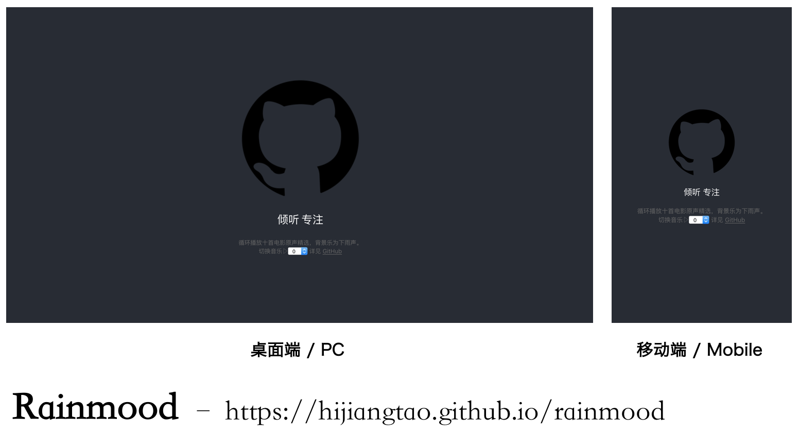

## Rainmood

一个简单项目，只有一个页面。循环播放十首电影原声精选，背景乐为下雨声。

十首电影原声列表如下：

|歌曲|歌手|专辑|
|---|---|---|
|Comptine d'un autre été: L'Après midi|Yann Tiersen|Le fabuleux destin d'Amélie Poulain|
|Fly|Ludovico Einaudi|Islands: Essential Einaudi|
|A Lannister Always Pays His Debts|Ramin Djawadi|Game Of Thrones: Season 3 (Music from the HBO® Series)|
|Falling|Nick Cave; Warren Ellis|The Assassination of Jesse James|
|The Heart Asks Pleasure First|Michael Nyman|The Piano (Bande Originale du Film)|
|Tu Ne Mentiras Pas Part 7|||
|By the Sea|||
|Vermeer's Studio|||
|Les Marionnettes|||
|Van Den Budenmayer Concerto en Mi Mineu, Version de 1798|||

雨声源自 <https://www.rainymood.com/>.

*注：媒体文件较大，需要一段时间才能加载完毕。*

## 联系

[@hijiangtao](https://github.com/hijiangtao)

## LICENSE

MIT
